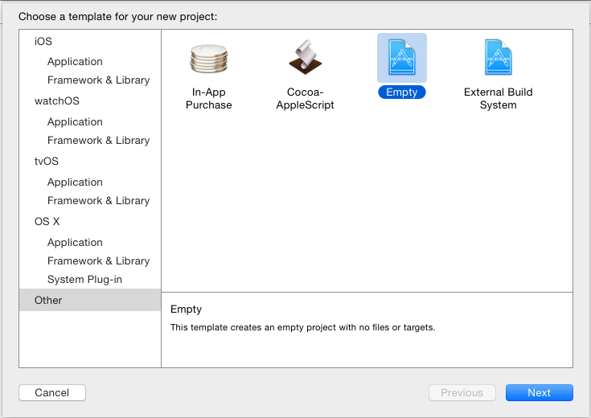
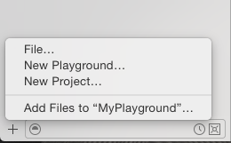
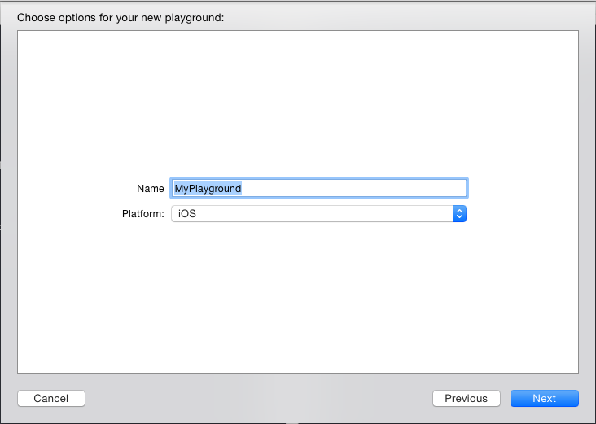
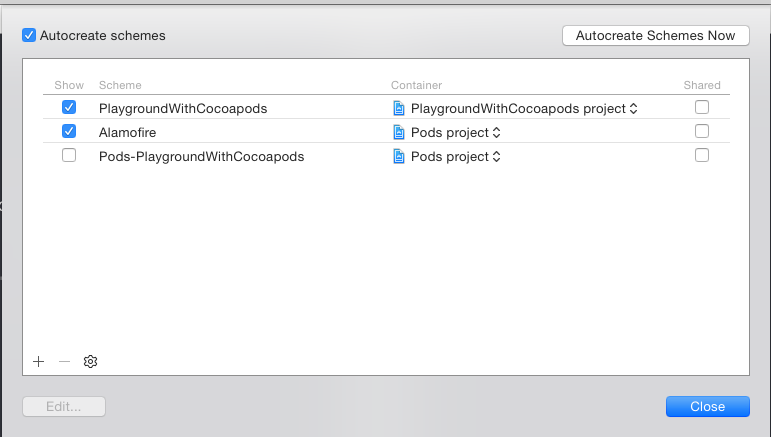
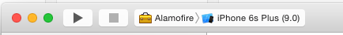

# Playground에서 CocoaPod 사용하기

Playground를 iOS/Mac 개발자에게 아주 유용한 놀이터입니다. 이 놀이터에 cocoapod으로 테스트해보고 싶은 라이브러리를 쉽게 추가할 수 있다면 아주 편리할 것 같네요. 그 방법을 알아보겠습니다.

## 1. Empty Project 생성

우선 CocoaPod을 사용하기 위해서는 프로젝트가 필요합니다. XCode를 실행 후 New Project를 선택합니다. 그 다음 아래 그림처럼 Other에서 Empty프로젝트를 생성합니다.



## 2. pod init

생성한 프로젝트의 폴더로 이동하여 pod init을 실행합니다.

```
$ pod init
```

그러면 Podfile이 생성되는데 아래처럼 작성해 줍니다. 이 글에서는 Alamofire를 추가하여 사용해 보겠습니다.

```
$ vi Podfile
```

```
platform :ios, '8.0'
use_frameworks!

target 'PlaygroundWithCocoapods' do
        pod 'Alamofire'
end
```

이제 pod install을 실행하여 워크스페이스를 만듭니다.

```
pod install
```


## 3. open ?.xcworksapce

위에서 생성된 워크스페이스를 xcode로 엽니다.

```
$ open PlaygroundWithCocoapods.xcworkspace
```

## 4. Playground 추가하기

이제 워크스페이스에 Playgroud를 추가합니다. 워크스페이스에 파일을 추가할 때는 하단의 `+`버튼을 눌러야 합니다.



아래 그림처럼 MyPlayground를 추가합니다.



## 5. 스키마에 Alamofire를 추가하기

Managed Scheme 메뉴를 선택해 아래처럼 Alamofire의 체크박스를 체크해 줍니다.



## 6. Alamofire타켓을 선택하고 빌드합니다.



## 7. MyPlayground

MyPlayground로 이동하여 아래와 같이 코드를 작성후 실행해 봅니다.

```swift
//: Playground - noun: a place where people can play

import UIKit
import Alamofire
import XCPlayground

XCPlaygroundPage.currentPage.needsIndefiniteExecution = true

Alamofire.request(Method.GET, "http://www.google.com")
    .responseString { response in
        if let value = response.result.value {
            print(value)
        }
    }
```

제 경우에는 Alamofire 를 처음 몇 초간은 찾지 못하다가 나중에 인식을 하더군요 :)